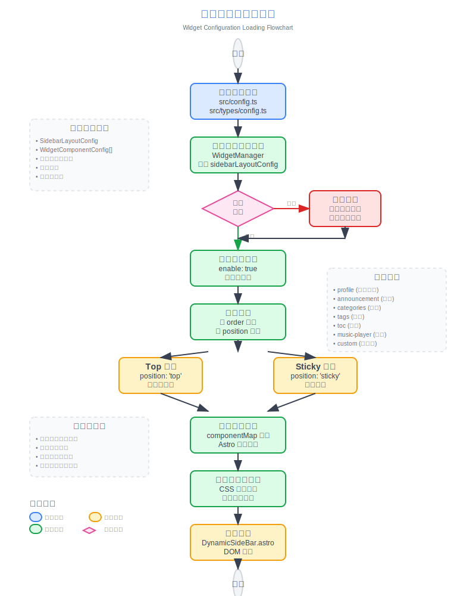

# 🌸 Mizuki  
 
 


[](https://opensource.org/licenses/MIT)


一个现代化、功能丰富的静态博客模板，基于 [Astro](https://astro.build) 构建，具有先进的功能和精美的设计。

[**🖥️ 在线演示**](https://mizuki.mysqil.com/)
[**📝 用户文档**](https://docs.mizuki.mysqil.com/)

🌏 README 语言
[**中文**](./README.md) /
[**English**](./README.en.md) /
[**日本語**](./docs/README.ja.md) /
[**中文繁体**](./docs/README.tw.md) /

<<<<<<< HEAD
<<<<<<< HEAD
<<<<<<< HEAD
<<<<<<< HEAD
<<<<<<< HEAD
## 🆕 What's New in v3.0



### 🔧 Component Configuration System Refactor
- **Unified Configuration Architecture:** Brand new modular component configuration system with dynamic component management and order configuration
- **Configuration-Driven Component Loading:** Refactored SideBar component to implement fully configuration-based component loading mechanism
- **Unified Control Switches:** Removed independent enable switches for music player and announcement components, unified control through sidebarLayoutConfig
- **Responsive Layout Adaptation:** Components support responsive layout, automatically adjusting display based on device type

### 📐 Layout System Optimization
- **Dynamic Sidebar Position Adjustment:** Support for left/right sidebar switching with automatic layout adaptation
- **Smart Article Navigation Positioning:** When sidebar is on the right, article navigation automatically moves to the left for better reading experience
- **Grid Layout Improvements:** Optimized CSS Grid layout, resolved container width anomaly issues

### 🎛️ Configuration File Format Standards
- **Standardized Configuration Format:** Created unified component configuration file format specifications
- **Type Safety:** Comprehensive TypeScript type definitions ensuring configuration type safety
- **Extensibility:** Support for custom component types and configuration options

### 🧹 Code Optimization
- **Test File Cleanup:** Removed unused test configurations and dependencies, reducing project size
- **Code Structure Optimization:** Improved component architecture, enhanced code maintainability
- **Performance Improvements:** Optimized component loading logic, improved page rendering performance
=======
## 🆕 v3.0 版本更新
=======
=======
## 🆕 v4.0 版本更新
- **全屏背景图片功能：** 新增非Banner模式下的全屏背景图片支持，提供沉浸式的视觉体验。支持轮播切换、透明度调节和模糊效果配置。
- **资源路径优化：** 修复了Banner模式和全屏壁纸模式下的图片资源调用问题，确保能正确从public目录获取资源。
- **导航栏透明效果：** 优化了全屏壁纸模式下导航栏的半透明圆角效果，提升视觉一致性。
- **手机端Banner优化：** 支持调用外部链接


=======
## 🆕 v4.3 版本更新
- **番剧页面：** 重构了更可爱好看的番剧页面，包括番剧列表、番剧详情和番剧时间轴。
- **相册页面：** 重构了相册页面,使用分页+文件夹数据索引方案
>>>>>>> upstream/master
=======
## 🆕 v4.6 版本更新
- **番剧页面：** 重构了更可爱好看的番剧页面，包括番剧列表、番剧详情和番剧时间轴。
- **相册页面：** 重构了相册页面,使用分页+文件夹数据索引方案
- **全新的动画：** 使用了全新的动画组件，使页面更加流畅和美观
- **图片API的支持** 支持图片API，可以快速获取图片信息,使用(PicFlow API项目)[https://github.com/matsuzaka-yuki/PicFlow-API]
>>>>>>> upstream/master

>>>>>>> upstream/master
## 🆕 v3.4 版本更新
- **新增页面：** 添加了项目展示、技能展示和时间线专属页面，用于展示您的工作、专业技能和成长历程。
- **下拉菜单修复：** 解决了下拉菜单点击时出现边框轮廓的问题，提升了界面一致性。
- **搜索功能优化：** 增强了搜索功能的性能和准确性。
- **底部HTML注入：** 引入了新功能，允许在页面底部注入自定义HTML内容，提供更大的灵活性。


## 🆕 v3.3 版本更新
- **Mermaid 语法支持：** 添加了对 Mermaid 图表语法的支持，现在可以在 Markdown 中直接嵌入流程图、序列图、甘特图等。
- **Umami 访问统计：** 添加了对 Umami 访问统计的支持，可以轻松集成网站访问数据分析。
>>>>>>> upstream/master


### 🔧 组件配置系统重构
- **统一配置架构：** 全新的模块化组件配置体系，支持动态组件管理和顺序配置
- **配置驱动的组件加载：** 重构 SideBar 组件，实现完全基于配置的组件加载机制
- **统一控制开关：** 移除音乐播放器和公告组件的独立 enable 开关，统一由 sidebarLayoutConfig 控制
- **响应式布局适配：** 组件支持响应式布局，可根据设备类型自动调整显示

### 📐 布局系统优化
- **侧边栏位置动态调整：** 支持左右侧边栏切换，布局自动适配
- **文章目录智能定位：** 当侧边栏在右侧时，文章导航自动移至左侧，提供更好的阅读体验
- **网格布局改进：** 优化 CSS Grid 布局，解决容器宽度异常问题

### 🎛️ 配置文件格式规范
- **标准化配置格式：** 创建统一的组件配置文件格式规范
- **类型安全：** 完善的 TypeScript 类型定义，确保配置的类型安全
- **可扩展性：** 支持自定义组件类型和配置选项

### 🧹 代码优化
- **测试文件清理：** 移除未使用的测试配置和依赖，减少项目体积
- **代码结构优化：** 改进组件架构，提升代码可维护性
- **性能提升：** 优化组件加载逻辑，提升页面渲染性能
>>>>>>> upstream/master

---

## ✨ 功能特性

### 🎨 设计与界面
- [x] 基于 [Astro](https://astro.build) 和 [Tailwind CSS](https://tailwindcss.com) 构建
- [x] 使用 [Swup](https://swup.js.org/) 实现流畅的动画和页面过渡
- [x] 明暗主题切换，支持系统偏好检测
- [x] 可自定义主题色彩和动态横幅轮播
- [x] 全屏背景图片，支持轮播、透明度和模糊效果
- [x] 全设备响应式设计
- [x] 使用 JetBrains Mono 字体的优美排版

### 🔍 内容与搜索
- [x] 基于 [Pagefind](https://pagefind.app/) 的高级搜索功能
- [x] [增强的 Markdown 功能](#-markdown-扩展语法)，支持语法高亮
- [x] 交互式目录，支持自动滚动
- [x] RSS 订阅生成
- [x] 阅读时间估算
- [x] 文章分类和标签系统

### 🌐 国际化支持
- [x] **多语言支持**，实时翻译功能
- [x] **自动语言检测**，基于用户偏好
- [x] **客户端翻译**，由 Edge Translate 驱动
- [x] 支持 10+ 种语言（中文、英文、日文、韩文、西班牙文等）

### 📱 特色页面
- [x] **追番页面** - 追踪动画观看进度和评分
- [x] **友链页面** - 精美卡片展示朋友网站
- [x] **日记页面** - 分享生活瞬间，类似社交媒体
- [x] **归档页面** - 有序的文章时间线视图
- [x] **关于页面** - 可自定义的个人介绍

### 🛠 技术特性
- [x] **增强代码块**，基于 [Expressive Code](https://expressive-code.com/)
- [x] **数学公式支持**，KaTeX 渲染
- [x] **图片优化**，PhotoSwipe 画廊集成
- [x] **SEO 优化**，包含站点地图和元标签
- [x] **性能优化**，懒加载和缓存机制
- [x] **评论系统**，支持 Twikoo 集成

## 🚀 快速开始

### 📦 安装

1. **克隆仓库：**
   ```bash
   git clone https://github.com/matsuzaka-yuki/mizuki.git
   cd mizuki
   ```

2. **安装依赖：**
   ```bash
   # 如果没有安装 pnpm，先安装
   npm install -g pnpm
   
   # 安装项目依赖
   pnpm install
   ```

3. **配置博客：**
   - 编辑 `src/config.ts` 自定义博客设置
   - 更新站点信息、主题色彩、横幅图片和社交链接
   - 配置翻译设置和特色页面功能

4. **启动开发服务器：**
   ```bash
   pnpm dev
   ```
   博客将在 `http://localhost:4321` 可用

### 📝 内容管理

- **创建新文章：** `pnpm new-post <文件名>`
- **编辑文章：** 修改 `src/content/posts/` 中的文件
- **自定义页面：** 编辑 `src/content/spec/` 中的特殊页面
- **添加图片：** 将图片放在 `src/assets/` 或 `public/` 中

### 🚀 部署

将博客部署到任何静态托管平台：

- **Vercel：** 连接 GitHub 仓库到 Vercel
- **Netlify：** 直接从 GitHub 部署
- **GitHub Pages：** 使用包含的 GitHub Actions 工作流
- **Cloudflare Pages：** 连接您的仓库

部署前，请在 `astro.config.mjs` 中更新 `site` URL。

## 📝 文章前言格式

```yaml
---
title: 我的第一篇博客文章
published: 2023-09-09
description: 这是我新博客的第一篇文章。
image: ./cover.jpg
tags: [标签1, 标签2]
category: 前端
draft: false
pinned: false
lang: zh-CN      # 仅当文章语言与 config.ts 中的站点语言不同时设置
---
```

### Frontmatter 字段说明

- **title**: 文章标题（必需）
- **published**: 发布日期（必需）
- **description**: 文章描述，用于 SEO 和预览
- **image**: 封面图片路径（相对于文章文件）
- **tags**: 标签数组，用于分类
- **category**: 文章分类
- **draft**: 设置为 `true` 在生产环境中隐藏文章
- **pinned**: 设置为 `true` 将文章置顶
- **lang**: 文章语言（仅当与站点默认语言不同时设置）

### 置顶文章功能

`pinned` 字段允许您将重要文章置顶到博客列表的顶部。置顶文章将始终显示在普通文章之前，无论其发布日期如何。

**使用方法：**
```yaml
pinned: true  # 将此文章置顶
pinned: false # 普通文章（默认）
```

**排序规则：**
1. 置顶文章优先显示，按发布日期排序（最新在前）
2. 普通文章随后显示，按发布日期排序（最新在前）

## 🧩 Markdown 扩展语法

Mizuki 支持超越标准 GitHub Flavored Markdown 的增强功能：

### 📝 增强写作
- **提示框：** 使用 `> [!NOTE]`、`> [!TIP]`、`> [!WARNING]` 等创建精美的标注框
- **数学公式：** 使用 `$行内$` 和 `$$块级$$` 语法编写 LaTeX 数学公式
- **代码高亮：** 高级语法高亮，支持行号和复制按钮
- **GitHub 卡片：** 使用 `::github{repo="用户/仓库"}` 嵌入仓库卡片

### 🎨 视觉元素
- **图片画廊：** 自动 PhotoSwipe 集成，支持图片查看
- **可折叠部分：** 创建可展开的内容块
- **自定义组件：** 使用特殊指令增强内容

### 📊 内容组织
- **目录：** 从标题自动生成，支持平滑滚动
- **阅读时间：** 自动计算和显示
- **文章元数据：** 丰富的前言支持，包含分类和标签

## ⚡ 命令

所有命令都在项目根目录运行：

| 命令                       | 操作                                    |
|:---------------------------|:---------------------------------------|
| `pnpm install`             | 安装依赖                               |
| `pnpm dev`                 | 在 `localhost:4321` 启动本地开发服务器 |
| `pnpm build`               | 构建生产站点到 `./dist/`               |
| `pnpm preview`             | 在部署前本地预览构建                   |
| `pnpm check`               | 运行 Astro 错误检查                    |
| `pnpm format`              | 使用 Biome 格式化代码                  |
| `pnpm lint`                | 检查并修复代码问题                     |
| `pnpm new-post <文件名>`   | 创建新博客文章                         |
| `pnpm astro ...`           | 运行 Astro CLI 命令                    |

## 🎯 配置指南

### 🔧 基础配置

编辑 `src/config.ts` 自定义您的博客：

```typescript
export const siteConfig: SiteConfig = {
  title: "您的博客名称",
  subtitle: "您的博客描述",
  lang: "zh-CN", // 或 "en"、"ja" 等
  themeColor: {
    hue: 210, // 0-360，主题色调
    fixed: false, // 隐藏主题色选择器
  },
  translate: {
    enable: true, // 启用翻译功能
    service: "client.edge", // 翻译服务
    defaultLanguage: "chinese_simplified",
  },
  banner: {
    enable: true,
    src: ["assets/banner/1.webp"], // 横幅图片
    carousel: {
      enable: true,
      interval: 0.8, // 秒
    },
  },
};
```

### 📱 特色页面配置

- **追番页面：** 在 `src/pages/anime.astro` 中编辑动画列表
- **友链页面：** 在 `src/content/spec/friends.md` 中编辑朋友数据
- **日记页面：** 在 `src/pages/diary.astro` 中编辑动态
- **关于页面：** 在 `src/content/spec/about.md` 中编辑内容

## ✏️ 贡献

我们欢迎贡献！请随时提交问题和拉取请求。

1. Fork 仓库
2. 创建功能分支 (`git checkout -b feature/amazing-feature`)
3. 提交更改 (`git commit -m 'Add some amazing feature'`)
4. 推送到分支 (`git push origin feature/amazing-feature`)
5. 打开拉取请求

## 📄 许可证

本项目基于 MIT 许可证 - 查看 [LICENSE](LICENSE) 文件了解详情。

## 🙏 致谢

- 基于原始 [Fuwari](https://github.com/saicaca/fuwari) 模板
- 使用 [Astro](https://astro.build) 和 [Tailwind CSS](https://tailwindcss.com) 构建
- 灵感来源于 [Yukina](https://github.com/WhitePaper233/yukina) - 一个美丽优雅的博客模板
- 翻译功能由 [translate](https://gitee.com/mail_osc/translate) 提供支持 - AI i18n 自动HTML翻译解决方案
- 图标来自 [Iconify](https://iconify.design/)

### 特别感谢

- **[Yukina](https://github.com/WhitePaper233/yukina)** - 感谢提供设计灵感和创意，帮助塑造了这个项目。Yukina 是一个优雅的博客模板，展现了出色的设计原则和用户体验。
- **[translate](https://gitee.com/mail_osc/translate)** - 感谢提供创新的AI驱动i18n解决方案，仅需两行JavaScript代码即可实现HTML自动翻译。这个开源工具让多语言支持变得极其简单高效。

---

⭐ 如果您觉得这个项目有帮助，请考虑给它一个星标！